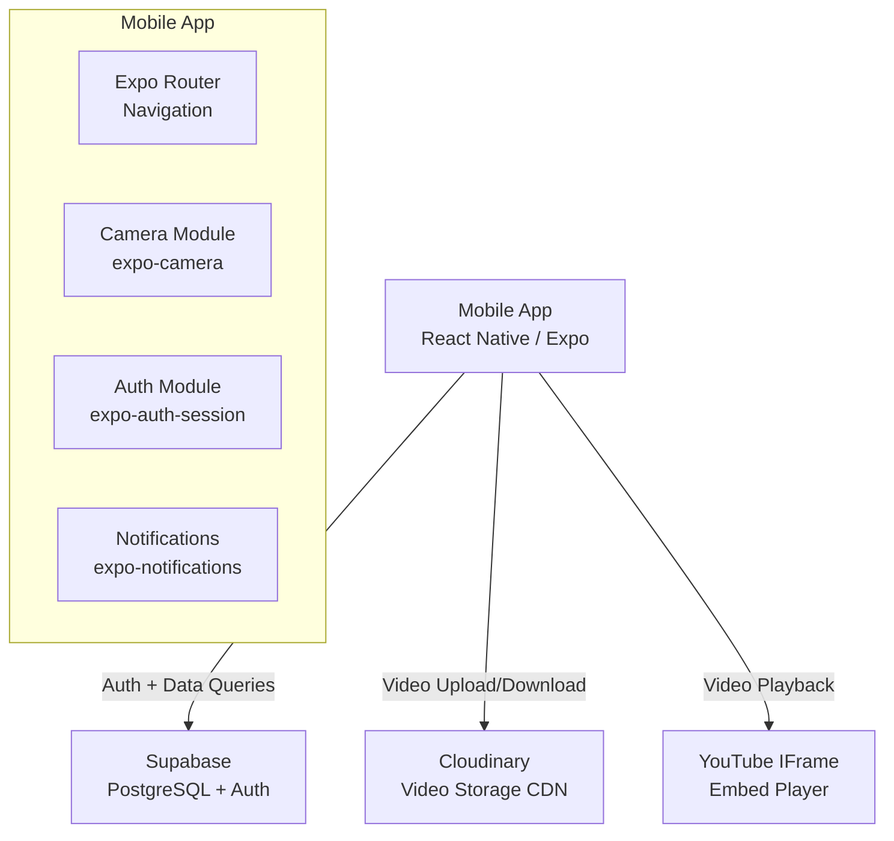

# Architecture Document

## 1. High-Level App Flow

```
User opens app
    |
    v
[React Native / Expo Frontend]
    |
    +--> [Supabase: PostgreSQL DB + Auth]
    |
    +--> [Cloudinary: Video Comment Storage]
    |
    +--> [YouTube Embed: Video Playback]
```

### User Journey

1. User opens app → sees Home feed with video grid
2. User taps a video → navigates to Watch page
3. YouTube video plays via embedded player
4. User scrolls down to the comment section
5. User writes a text comment OR records/uploads a video comment
6. Optionally pins the comment to the current playback timestamp
7. Comment is sent to the backend and stored in Supabase
8. For video comments, the clip is uploaded to Cloudinary and the URL is stored
9. Comments are fetched and rendered as a threaded tree
10. User can reply to any comment → forms a nested conversation

## 2. System Architecture



## 3. Folder & File Structure

```
mobile/
├── app/                          # Expo Router (file-based routing)
│   ├── _layout.tsx               # Root layout (providers, theme)
│   ├── (tabs)/
│   │   ├── _layout.tsx           # Tab bar config (Home, Search, Upload, Notifications, Profile)
│   │   ├── index.tsx             # Home feed — video grid
│   │   ├── search.tsx            # Search page
│   │   ├── upload.tsx            # Add video by YouTube URL
│   │   ├── notifications.tsx     # Notifications list
│   │   └── profile.tsx           # User profile + sign out
│   ├── watch/
│   │   └── [id].tsx              # Watch page — player + comments
│   ├── auth/
│   │   └── login.tsx             # Login / sign-up
│   └── video-record/
│       └── index.tsx             # Camera screen for recording video comments
│
├── components/                   # Reusable UI components
│   ├── VideoPlayer.tsx           # YouTube embed wrapper
│   ├── CommentThread.tsx         # Recursive comment tree
│   ├── CommentItem.tsx           # Single comment card
│   ├── CommentComposer.tsx       # Text/video comment input
│   ├── TimestampMarker.tsx       # Time badge on scrubber
│   ├── VideoCard.tsx             # Video thumbnail card
│   └── DisplayNamePrompt.tsx     # Display name modal
│
├── lib/                          # Core utilities and clients
│   ├── supabase.ts               # Supabase client (with SecureStore for auth)
│   ├── api.ts                    # API wrappers (apiGet, apiPost, apiUpload)
│   ├── auth.ts                   # Auth helpers (signIn, signOut, getSession)
│   ├── youtube.ts                # YouTube URL parsing, video ID extraction
│   ├── cloudinary.ts             # Cloudinary direct upload from mobile
│   └── utils.ts                  # Formatting, time-ago, helpers
│
├── hooks/                        # Custom React hooks
│   └── useYouTubePlayer.ts       # YouTube player control + time tracking
│
├── types/
│   └── index.ts                  # Shared TypeScript types
│
├── constants/
│   └── theme.ts                  # Color palette, typography, spacing
│
├── context/
│   └── ThemeContext.tsx           # Light/dark mode provider
│
├── assets/                       # Icons, splash screen, fonts
├── app.json                      # Expo configuration
├── eas.json                      # EAS Build configuration
├── package.json
└── tsconfig.json
```

## 4. Tech Stack

| Concern | Choice | Justification |
|---------|--------|---------------|
| **UI Framework** | React Native + Expo | Cross-platform (iOS + Android) from a single codebase. Expo provides managed workflow, over-the-air updates, and easy build/deploy. |
| **Navigation** | Expo Router | File-based routing, same mental model as Next.js. Tab + stack navigation built-in. |
| **Styling** | StyleSheet API + React Native built-ins | No extra dependencies. Native performance. Optional: NativeWind for Tailwind-like syntax. |
| **Database + Auth** | Supabase (PostgreSQL) | Managed Postgres with built-in auth, row-level security, and real-time subscriptions. Free tier. |
| **Authentication** | Supabase Auth + expo-auth-session | Google OAuth via in-app browser. Tokens stored in expo-secure-store (iOS Keychain / Android Keystore). |
| **Video Playback** | react-native-youtube-iframe | Wraps YouTube IFrame API in a WebView. Reliable, well-maintained. |
| **Camera** | expo-camera | Native camera access on both platforms. Reliable, full control over recording. |
| **Video Comments** | Cloudinary | Free tier, built-in compression, thumbnail generation, global CDN. Direct upload from mobile (no CORS issues). |
| **Notifications** | expo-notifications + Expo Push Service | Native push notifications on both platforms. Free via Expo. |
| **State** | React Context + hooks | Lightweight, no extra dependencies. Sufficient for this app's complexity. |
| **Auth Storage** | expo-secure-store | OS-level encryption (iOS Keychain / Android Keystore). Standard for mobile auth tokens. |
| **Video Compression** | expo-video-thumbnails + FFmpeg (future) | On-device compression before upload to save bandwidth and stay within Cloudinary limits. |
| **Gestures** | react-native-gesture-handler | Native gesture system. Required by Expo Router. |
| **Animations** | react-native-reanimated | Native-driven animations for thread expand/collapse, transitions. |
